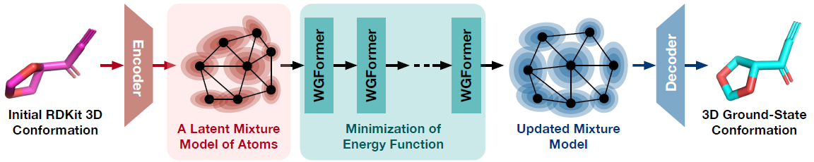
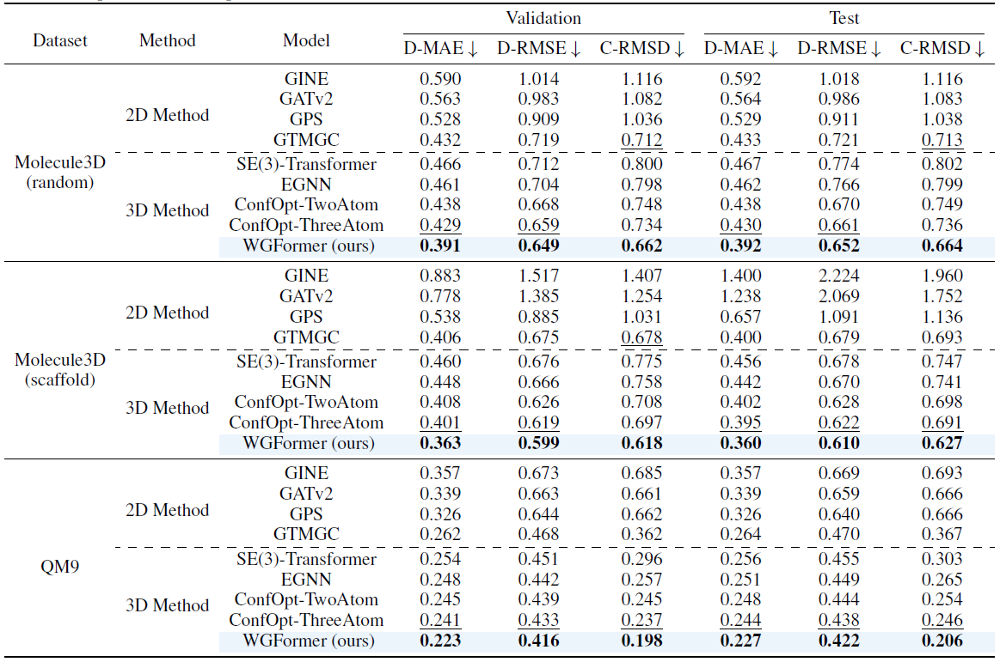

<div align=center>

# ⚡️WGFormer: An SE(3)-Transformer Driven by Wasserstein Gradient Flows for Molecular Ground-State Conformation Prediction (ICML 2025)

[](https://arxiv.org/abs/2410.09795)
[](https://drive.google.com/drive/folders/1lVACTNf-y2M0qiXs8ybDp6Jlngaxq-cu?usp=sharing)
[](LICENSE)

</div>

## 🚀 Introduction
Our <span style="color:red">**WGFormer**</span> achieves <span style="color:red">**state-of-the-art**</span> performance in molecular ground-state conformation predictioin.
In particular, our WGFormer can be interpreted as Wasserstein gradient flows, which optimizes molecular conformation by minimizing a physically reasonable energy function defined on the latent mixture models of atoms, thereby significantly improving the model performance and interpretability.
<p align="center" style="margin-top: 0px;">
  
</p>
<p align="center" style="margin-top: 0px;">
  
</p>

## ⚒️ Environment
We have provided an `env.yml` file that contains the necessary environment dependencies. 
To set up your environment, please execute:
``` cmd
conda env create -f env.yml
conda activate WGFormer
```

## 📦 Datasets
We use the Molecule3D and QM9 provided in [GTMGC](https://github.com/Rich-XGK/GTMGC) as our datasets. Please download them and organize the `./data` directory as follows:
```
data
├── Molecule3D
│   ├── Random
│   │   ├── dict.txt
│   │   ├── random_train.csv
│   │   ├── random_train_0.sdf
│   │   ├── random_train_1.sdf
│   │   ├── random_train_2.sdf
│   │   ├── random_train_3.sdf
│   │   ├── random_valid.csv
│   │   ├── random_valid.sdf
│   │   ├── random_test.csv
│   │   └── random_test.sdf
│   ├── Scaffold
│   │   ├── dict.txt
│   │   ├── scaffold_train.csv
│   │   ├── scaffold_train_0.sdf
│   │   ├── scaffold_train_1.sdf
│   │   ├── scaffold_train_2.sdf
│   │   ├── scaffold_train_3.sdf
│   │   ├── scaffold_valid.csv
│   │   ├── scaffold_valid.sdf
│   │   ├── scaffold_test.csv
│   │   └── scaffold_test.sdf
├── QM9
│   ├── dict.txt
│   ├── gdb9.sdf
│   ├── train_indices.csv
│   ├── valid_indices.csv
│   └── test_indices.csv
```
Then, execute the command below to obtain the processed datasets:
``` cmd
cd data
python process_QM9.py
python process_Molecule3D.py
```
Here, the processed QM9 dataset has been provided in this [link](https://drive.google.com/file/d/11WWuN_3hGKm7ZKltgUjlx4sKsHo9wP8A/view?usp=sharing).

## 💪 Experiments
### Training
Our model weights have been provided in this [link](https://drive.google.com/drive/folders/1lVACTNf-y2M0qiXs8ybDp6Jlngaxq-cu?usp=sharing). 
You can also train from scratch by running the following script.
``` cmd
bash train.sh
```
### Inference
``` cmd
bash inference.sh valid
bash inference.sh test
```
### Evaluation
``` cmd
python eval.py valid
python eval.py test
```

## 👍 Acknowledgments
This code is built upon [Uni-Mol](https://github.com/dptech-corp/Uni-Mol) and [Uni-Core](https://github.com/dptech-corp/Uni-Core). Thanks for their contribution.

## 📌 Citation
If you find this work useful for your research, please consider citing it. 😊
```bibtex
@inproceedings{wang2025wgformer,
      title={WGFormer: An SE(3)-Transformer Driven by Wasserstein Gradient Flows for Molecular Ground-State Conformation Prediction}, 
      author={Fanmeng Wang and Minjie Cheng and Hongteng Xu},
      booktitle={International Conference on Machine Learning},
      year={2025},
      organization={PMLR}
}
```


